# Melodex 🎵

> A local Spotify playlist manager that actually understands your library.

Melodex connects to your Spotify account and gives you a proper dashboard to analyse playlists, find duplicate tracks, explore artists, track your listening history, and create artist-only playlists — all from a fast local web app with 5 switchable themes.

---

## Screenshots

| Dashboard | Playlists |
|---|---|
| 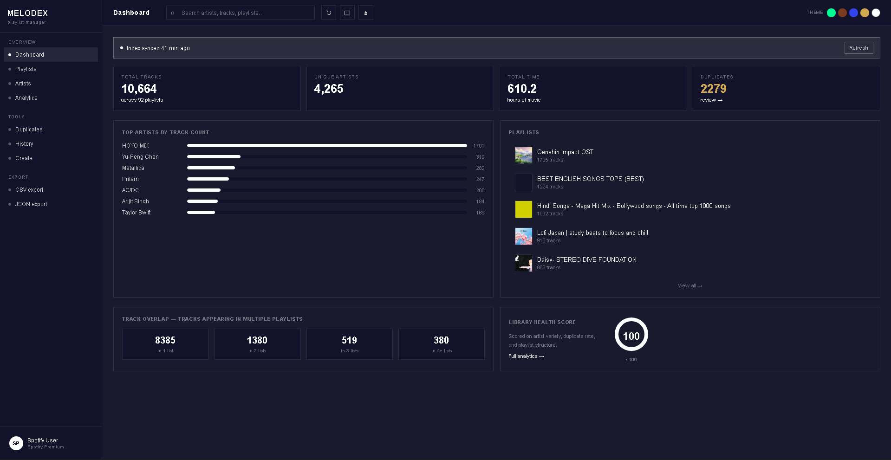 | 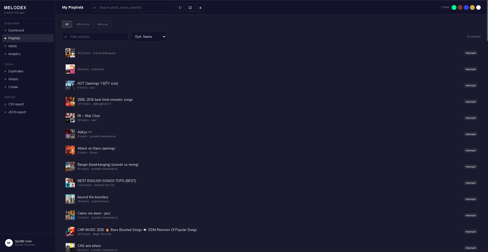 |

| Artists | Analytics |
|---|---|
| 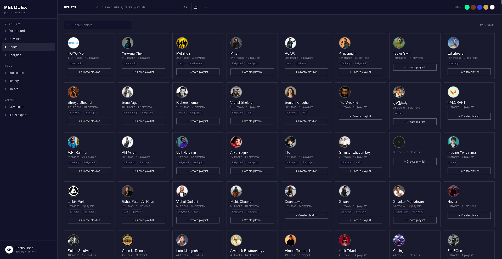 | 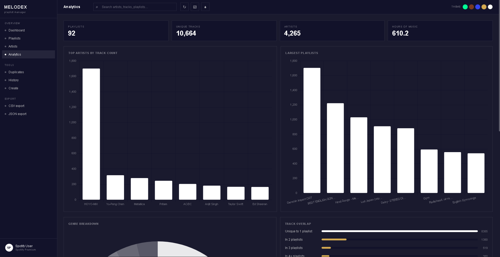 |

| Duplicates | History |
|---|---|
| 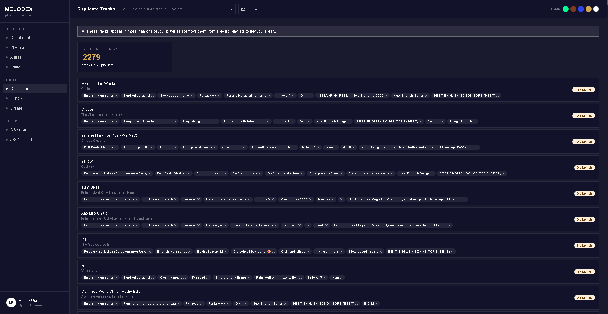 | 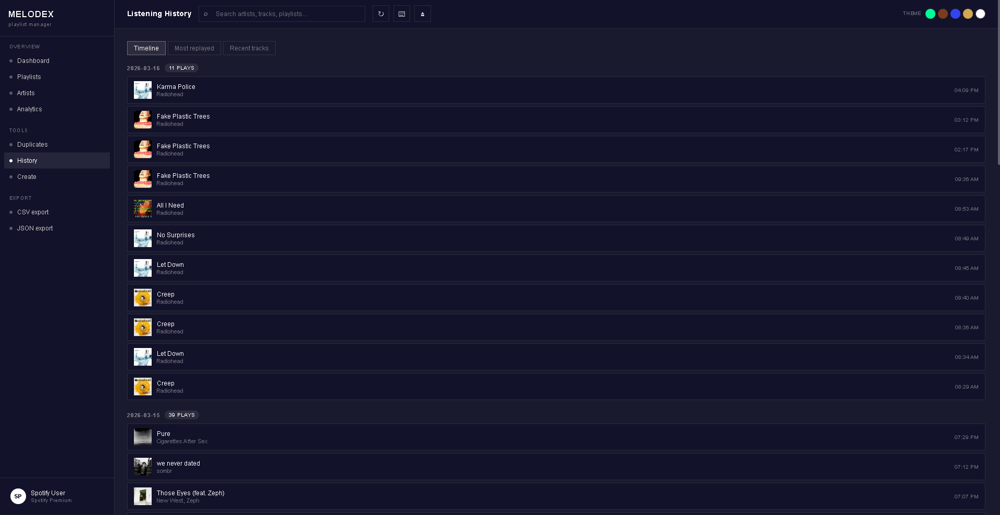 |

| Create | |
|---|---|
| 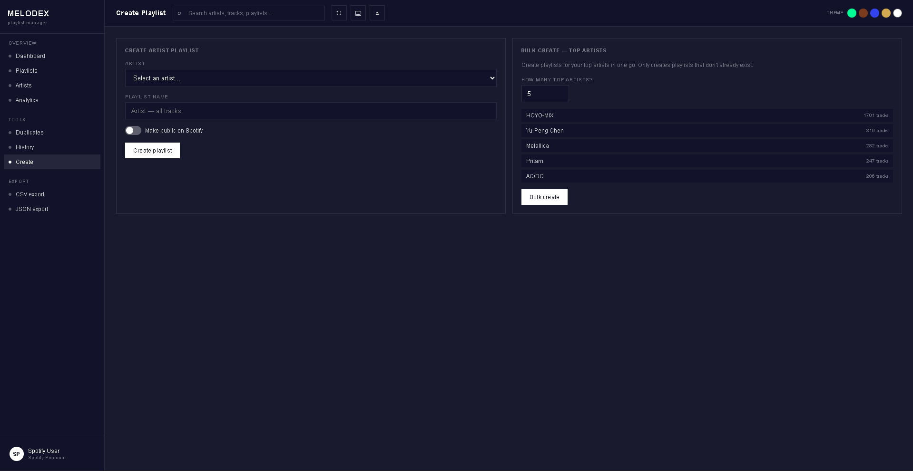 | |

### Themes
| Cyber | Paper | Aurora | Obsidian | Chalk |
|---|---|---|---|---|
| 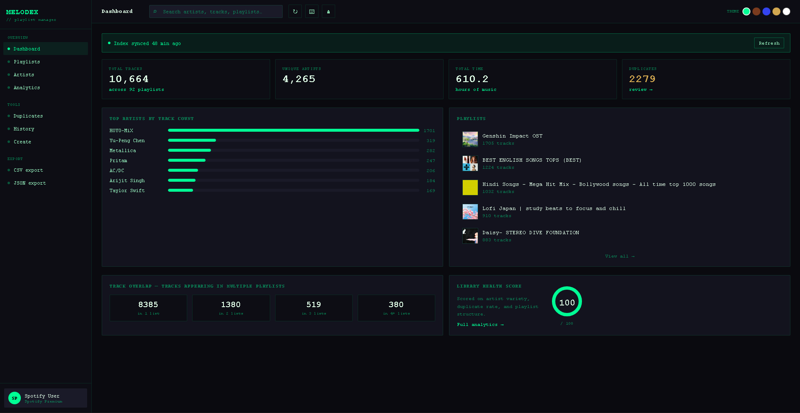 | 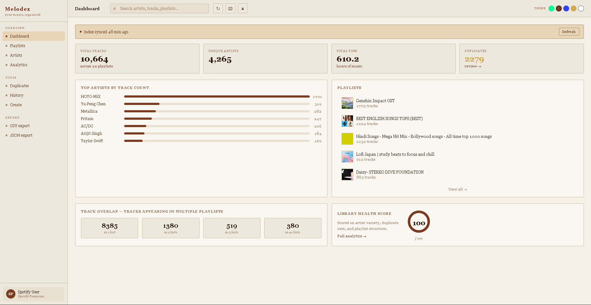 | 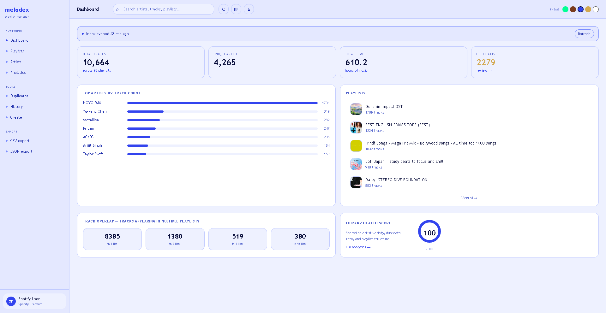 | 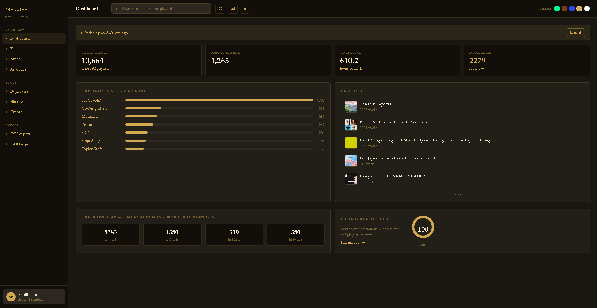 | 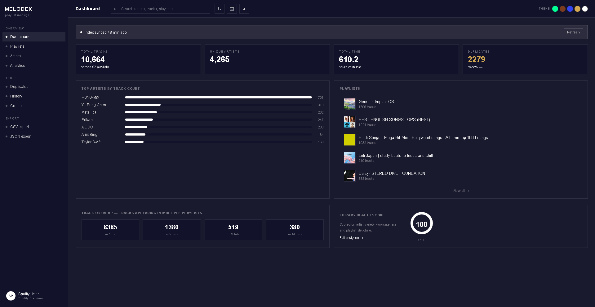 |

---

## Features

### Core
- **Dashboard** — library overview with total tracks, unique artists, hours of music, health score, top artist bar chart, playlist overlap matrix, and recent playlists
- **Playlists** — browse all playlists with cover art, filter by type (all / artist-only / manual), sort by name or track count, click any playlist to see its full track list with durations and 30s previews
- **Artists** — card grid enriched with genre tags and Spotify profile images, click any artist to open a track drawer, create an artist-only playlist in one click
- **Analytics** — top artists chart, largest playlists chart, genre donut chart, track overlap breakdown, library health score
- **Duplicates** — detects every track appearing in more than one playlist, lets you remove it from specific playlists individually
- **History** — recently played tracks grouped by date (timeline view), most-replayed tracks, raw recent list — requires Spotify Premium
- **Create** — single artist playlist creator with name editing and public/private toggle, or bulk-create playlists for your top N artists at once
- **Smart Merge** — combine two or more playlists into one with automatic deduplication
- **Export** — download your full library index as CSV or JSON

### Technical
- **Persistent SQLite cache** — index survives server restarts, configurable TTL (default 1 hour)
- **Auto token refresh** — Spotify access tokens silently refreshed before expiry, no mid-session logouts
- **Retry + rate limit handling** — all Spotify API calls retry on 429s with proper backoff
- **5 switchable themes** — Cyber, Paper, Aurora, Obsidian, Chalk — persisted in localStorage
- **Keyboard shortcuts** — full keyboard navigation, press `?` to see all shortcuts
- **Mobile responsive** — sidebar collapses to icons on small screens

---

## Tech Stack

| Layer | Technology |
|---|---|
| Backend | Python 3.10+, FastAPI, Uvicorn |
| Auth | Spotify OAuth 2.0 with refresh token flow |
| Cache | SQLite via Python built-in sqlite3 |
| HTTP client | httpx (async) |
| Templates | Jinja2 |
| Frontend | Vanilla HTML, CSS, JavaScript |
| Charts | Chart.js 4 |

---

## Project Structure

```
melodex/
├── run.py                          # Entry point
├── .env.example                    # Environment variable template
├── requirements.txt                # Pinned Python dependencies
│
├── app/
│   ├── main.py                     # FastAPI app, middleware, router registration
│   │
│   ├── auth/
│   │   ├── spotify_auth.py         # OAuth login/callback, auto token refresh
│   │   └── token_store.py          # Persist tokens to SQLite
│   │
│   ├── cache/
│   │   └── cache_manager.py        # SQLite-backed key-value cache with TTL
│   │
│   ├── services/
│   │   ├── spotify_client.py       # Base HTTP client, retry, rate limit handling
│   │   ├── index_service.py        # Builds global artist/track/playlist index
│   │   ├── playlist_service.py     # Create, merge playlist operations
│   │   ├── artist_service.py       # Genre enrichment, artist cards
│   │   └── history_service.py      # Recently played, repeat tracks, timeline
│   │
│   ├── routers/
│   │   ├── playlists.py            # /playlists, /api/playlists, /api/index
│   │   ├── artists.py              # /artists, /api/artists, /api/genres
│   │   ├── analytics.py            # /analytics, /api/analytics/summary, /api/user
│   │   ├── duplicates.py           # /duplicates, /api/duplicates
│   │   ├── history.py              # /history, /api/history/*
│   │   └── export.py               # /api/export/csv, /api/export/json
│   │
│   ├── templates/                  # Jinja2 HTML pages
│   │   ├── base.html               # Shared layout: sidebar, topbar, theme switcher
│   │   ├── login.html              # Spotify connect page
│   │   ├── index.html              # Dashboard
│   │   ├── playlists.html          # Playlist browser + track drawer
│   │   ├── artists.html            # Artist grid + artist drawer
│   │   ├── analytics.html          # Charts and stats
│   │   ├── duplicates.html         # Duplicate track manager
│   │   ├── history.html            # Listening history
│   │   ├── create.html             # Playlist creator
│   │   └── error.html              # Error page
│   │
│   └── static/
│       ├── css/
│       │   ├── base.css            # Reset, layout, cards, buttons, forms
│       │   ├── themes.css          # All 5 theme variable sets
│       │   └── components.css      # Sidebar, topbar, toast, shortcuts panel
│       └── js/
│           ├── theme.js            # Theme switcher + chart re-render on switch
│           ├── toast.js            # Toast notification system
│           ├── search.js           # Live search + filter
│           ├── shortcuts.js        # Keyboard shortcut bindings
│           └── charts.js           # Chart.js wrappers with theme-aware colors
│
└── docs/
    └── screenshots/                # UI screenshots (add your own here)
```

---

## Setup

### Prerequisites
- Python 3.10 or higher
- A Spotify account (Premium required for listening history)
- A Spotify Developer App ([create one here](https://developer.spotify.com/dashboard))

### 1. Create a Spotify Developer App

1. Go to [developer.spotify.com/dashboard](https://developer.spotify.com/dashboard)
2. Click **Create app**
3. Fill in any name and description
4. Add this **Redirect URI**: `http://127.0.0.1:8888/callback`
5. Select **Web API** under APIs used
6. Save and note your **Client ID** and **Client Secret**

### 2. Clone and configure

```bash
git clone https://github.com/subramanyapuneeth530/melodex.git
cd melodex

cp .env.example .env
# Edit .env with your credentials
```

### 3. Install dependencies

```bash
# Create virtual environment with Python 3.10 specifically
python3.10 -m venv .venv

# Activate
source .venv/bin/activate        # Mac / Linux
# .venv\Scripts\activate         # Windows

pip install -r requirements.txt
```

### 4. Run

```bash
python run.py
```

Open **http://127.0.0.1:8888**, click **Connect Spotify**, and authorise the app.

---

## First Run

The first time you load the dashboard, Melodex fetches and indexes your entire Spotify library. This takes anywhere from **10 seconds to a few minutes** depending on library size. The index is cached in `app/cache/melodex.db` and reused on every subsequent load — even after restarting the server.

To force a full re-index at any time, click the **↻** button in the top bar.

---

## Keyboard Shortcuts

Press **`?`** anywhere in the app to open the shortcuts panel.

| Shortcut | Action |
|---|---|
| `g d` | Go to Dashboard |
| `g p` | Go to Playlists |
| `g a` | Go to Artists |
| `g n` | Go to Analytics |
| `g u` | Go to Duplicates |
| `g h` | Go to History |
| `/` | Focus search bar |
| `?` | Show / hide shortcuts panel |
| `Esc` | Close any open panel |

---

## Environment Variables

| Variable | Required | Default | Description |
|---|---|---|---|
| `SPOTIFY_CLIENT_ID` | Yes | — | From Spotify Developer Dashboard |
| `SPOTIFY_CLIENT_SECRET` | Yes | — | From Spotify Developer Dashboard |
| `SPOTIFY_REDIRECT_URI` | Yes | — | Must match exactly in Spotify app settings |
| `SESSION_SECRET` | Yes | — | Any long random string for session signing |
| `HOST` | No | `127.0.0.1` | Server host |
| `PORT` | No | `8000` | Server port |
| `CACHE_TTL_SECONDS` | No | `3600` | Index cache lifetime in seconds |

---

## API Reference

| Method | Path | Description |
|---|---|---|
| GET | `/api/index` | Full library index (`?force=true` to rebuild) |
| GET | `/api/playlists` | Playlist list (`?q=`, `?sort=`, `?type=`) |
| GET | `/api/playlist/{id}/tracks` | All tracks in a playlist |
| POST | `/api/playlists/merge` | Merge playlists with deduplication |
| GET | `/api/artists` | All artists sorted by track count |
| GET | `/api/artist/{id}/tracks` | All tracks for a specific artist |
| POST | `/api/artists/{id}/create-playlist` | Create artist playlist on Spotify |
| GET | `/api/genres` | Genre breakdown across library |
| GET | `/api/analytics/summary` | Dashboard stats and health score |
| GET | `/api/user` | Current Spotify user profile |
| GET | `/api/duplicates` | Tracks appearing in 2+ playlists |
| DELETE | `/api/duplicates/{track_id}/from/{playlist_id}` | Remove track from a playlist |
| GET | `/api/history/recent` | Recently played tracks |
| GET | `/api/history/repeats` | Most replayed tracks |
| GET | `/api/history/timeline` | Recently played grouped by date |
| GET | `/api/export/csv` | Download index as CSV |
| GET | `/api/export/json` | Download index as JSON |

---

## Known Limitations

- **Audio features unavailable** — Spotify deprecated Audio Features, Audio Analysis, and Recommendations endpoints in November 2024. Mood detection, BPM sorting, and energy-based features are not possible.
- **Track previews may be missing** — Spotify no longer guarantees 30-second preview URLs for all tracks.
- **Large libraries are slow on first index** — Spotify paginates at 50 items per request. A library with 100 playlists may take several minutes to index the first time.
- **5 user limit** — Spotify restricts Developer Mode apps to 5 authorised users. Designed for personal use only.

---

## License

MIT
